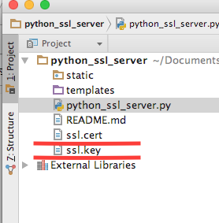

# python_ssl_server
一个简单搭建支持https  python web服务器和简单IOS端https实现,使用mac系统开发，pythonIDE使用Pycharm,python3.5
##准备：
1. pip --version  
   查看pip版本最好使用最新的，我用pip 9.0.1
2. python setup.py install --record files.txt  
   如果没有安装，[下载安装](https://pypi.python.org/pypi/pip)
3. pip install --upgrade pip  
   如果版本比较低，使用此命令更新
4. pip list  
   查看安装第三方module，确保有以下库：  
   Flask (0.11.1)  
   Jinja2 (2.8)  
   setuptools (18.2)  
   Werkzeug (0.11.11)（重要）  
5. python3 -m pip install Werkzeug  
  如果没有上面库，安装这些库  
6. pip install --upgrade Werkzeug  
  如果已经安装但是版本比较低，使用命令更新  
7. 生成ssl.cert和ssl.key文件[文档](http://werkzeug.pocoo.org/docs/0.11/serving/)  
 > $ openssl genrsa 1024 > ssl.key  
 > $ openssl req -new -x509 -nodes -sha1 -days 365 -key ssl.key > ssl.cert  
 并把生成ssl.key和ssl.cert拷贝到项目中
 
8. 使用非常简单，两行代码搞定  
```
from flask import Flask
import sys,os
import json
app = Flask(__name__)


@app.route('/')
def hello_world():
    return json.dumps([{'name':'xiaoLiZi','age':24},{'name':'xiaoWang','age':20},{'name':'zhangShan','age':18}])


if __name__ == '__main__':
    """
    1.crt 和 key文件设置绝对路径才有效,不知道为啥相当路径不行,以后再研究吧,有知道原因的可以一起分享下
    2.host 指向本机ip地址,localhost(127.0.0.1)不取作用,macx ip 地址可以通过终端ifconfig命令获取

    """
    context = (sys.path[0] + '/ssl.cert', sys.path[0] + '/ssl.key')
    app.run(debug=1, host='192.168.1.129', port=5500, ssl_context=context)

```
##步骤：
1. Pycharm创建一个flask项目
2.导入需要的库
```
from flask import Flask
import sys,os
import json
```
3.
##坑：
1.项目名不能和系统默认模块或者第三方模块名相同，不然无法找到正确模块（AttributeError: module 'ssl' has no attribute 'PROTOCOL_SSLv23’）

2.自己创建SSL证书（没有通过CA机构申请）测试站点时Google浏览器无法打开https链接，需换用Safari浏览器
